# Spherag | Sentek Soil Intelligence

<p align="center">
  
</p>

Proyecto de investigacion aplicada para detectar y caracterizar tipo de suelo a partir de telemetria multinivel Sentek, con pipeline reproducible en Python, datasets listos para Weka y soporte visual para analisis tecnico.

## Propuesta de valor

Este repositorio convierte logs operativos heterogeneos en evidencia util para modelado supervisado:

- Clasificacion WRB con etiqueta `soil_type_1`.
- Regresion USDA de `clay`, `sand`, `silt` por tramo de profundidad.
- Dataset unificado para auditoria de cobertura y trazabilidad.
- Diagnostico de integridad y figuras de control para defensa tecnica.

## Alcance cientifico

Pregunta principal de investigacion:

- Es posible discriminar tipo de suelo con senal Sentek multinivel real, sin instrumentacion adicional en cada muestra.

Hipotesis operativa:

- Los perfiles verticales de humedad, temperatura y VIC contienen estructura suficiente para clasificar WRB y aproximar textura USDA.

## Evidencia cuantitativa (carga probatoria)

Fuente: [results/diagnostics_report.json](results/diagnostics_report.json), [results/diagnostics_report.md](results/diagnostics_report.md).

- Archivos parquet procesados: 21.
- Dataset exploratorio Sentek: 282089 filas, 41 columnas.
- Dataset WRB: 44011 filas, 31 columnas.
- Dataset USDA: 44074 filas, 36 columnas.
- Dataset unificado: 97564 filas, 46 columnas.
- Contratos de columnas: OK en WRB, USDA y unificado.
- Consistencias cruzadas: OK entre WRB y unificado, USDA y unificado, CSV y ARFF.
- Figuras diagnosticas generadas: 11.

## Estructura principal del proyecto

```text
Spherag Proyecto 1/
  data/
    sensor_data_with_type.csv
    sensor_with_properties.csv
    unidades_sensores_multinivel.csv
    logs/                     # logs .parquet (no versionados)
  doc/
    documentacion_soil_type_1.md
    guia_puesta_en_marcha_vscode.md
    guia_soil_type_1_y_pipeline.md
    sentek_weka_metodologia.md
    memoria_proyecto.md
  presentacion/
    index.html
    dashboard.html
    datos.html
    figuras.html
    conclusiones.html
    styles.css
    script.js
    dashboard.js
    figuras.js
    build_presentation_data.py
    build_figuras_data.py
  results/
    diagnostics_report.json
    diagnostics_report.md
    figures/
  build_sentek_weka_datasets.py
  verify_sentek_data.py
  diagnose_sentek_pipeline.py
  sentek_sensor_only_weka.csv
  sentek_wrb_classify_ready.csv
  sentek_wrb_classify_ready.arff
  sentek_usda_regression_ready.csv
  sentek_unified_labeled_ready.csv
  requirements.txt
```

## Pipeline reproducible

### 1) Entorno

```powershell
python -m venv .venv
.\.venv\Scripts\Activate.ps1
pip install -r requirements.txt
```

### 2) Extraer telemetria Sentek limpia

```powershell
python verify_sentek_data.py
```

Salida principal:

- `sentek_sensor_only_weka.csv`

### 3) Construir datasets finales para Weka

```powershell
python build_sentek_weka_datasets.py
```

Salidas principales:

- `sentek_wrb_classify_ready.csv`
- `sentek_wrb_classify_ready.arff`
- `sentek_usda_regression_ready.csv`
- `sentek_unified_labeled_ready.csv`

### 4) Ejecutar diagnostico integral y figuras

```powershell
python diagnose_sentek_pipeline.py
```

Salidas principales:

- `results/diagnostics_report.json`
- `results/diagnostics_report.md`
- `results/figures/*.png`

## Matriz de figuras y patrones

Las figuras se generan en [results/figures](results/figures) y sustentan decisiones de modelado y riesgos metodologicos.

| Figura | Evidencia que aporta |
|---|---|
| 01 | Desbalance severo de clases WRB. |
| 02 | Visibilidad de clases minoritarias en escala log. |
| 03 | Ranking de variables con mayor missingness. |
| 04 | Comportamiento de huecos por profundidad y tipo de senal. |
| 05 | Firma media VWC por clase dominante. |
| 06 | Firma media de temperatura por clase dominante. |
| 07 | Colinealidad entre predictores clave. |
| 08 | Separabilidad aproximada en espacio reducido (PCA). |
| 09 | Distribucion de objetivos USDA en porcentajes. |
| 10 | Relacion entre arenas, limos y arcillas. |
| 12 | Curva de calibracion probabilistica (RF Cambisols vs resto). |
| 13 | Curva de decision: beneficio neto por umbral de clasificacion. |

## Galeria visual comentada

Tambien puedes abrir la version en formato pagina en [presentacion/figuras_comentadas.html](presentacion/figuras_comentadas.html).

### Figura 01: Distribucion WRB

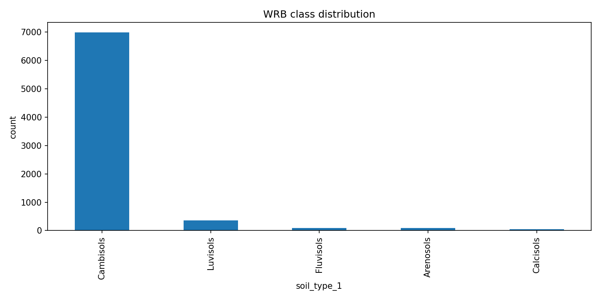

Comentario: desbalance severo de clases. Cambisols concentra la mayor parte de la muestra y condiciona metricas globales.

### Figura 02: Distribucion WRB (escala log)

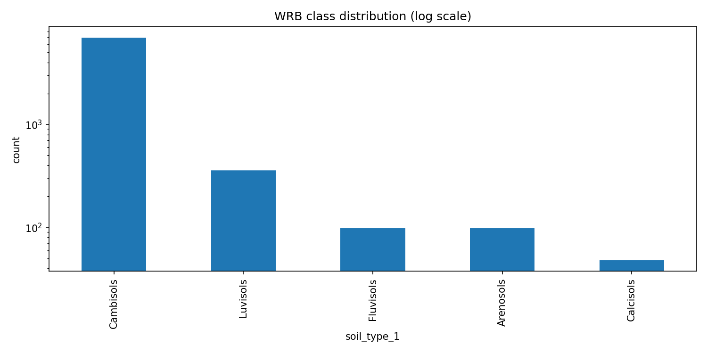

Comentario: en log se aprecia mejor el soporte de clases minoritarias, util para plan de rebalanceo y evaluacion justa.

### Figura 03: Top 20 missingness

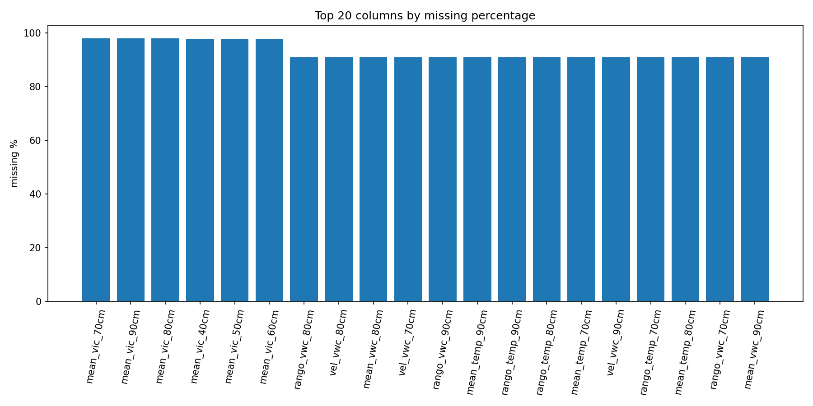

Comentario: identifica las variables con mayor porcentaje de faltantes para priorizar imputacion, exclusion o rediseño de features.

### Figura 04: Missingness por profundidad y senal

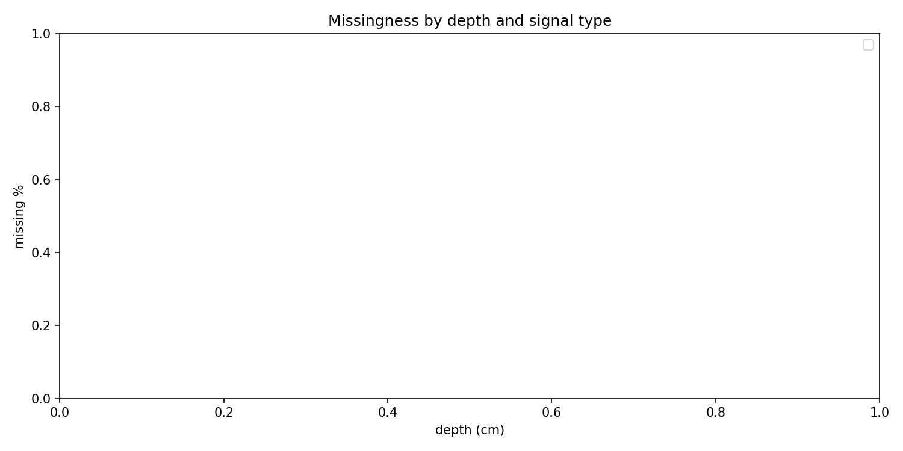

Comentario: el patron de faltantes no es uniforme; hay canales y profundidades mas inestables en captura.

### Figura 05: Perfil VWC por clases top

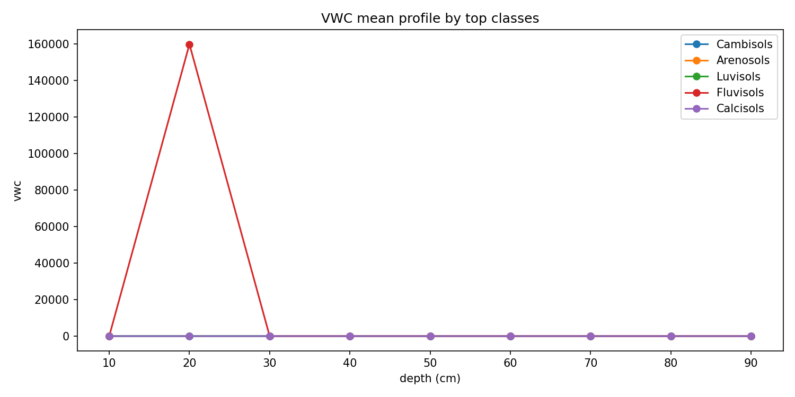

Comentario: muestra huellas hidricas medias por profundidad, relevantes para separabilidad fisica entre clases WRB.

### Figura 06: Perfil de temperatura por clases top

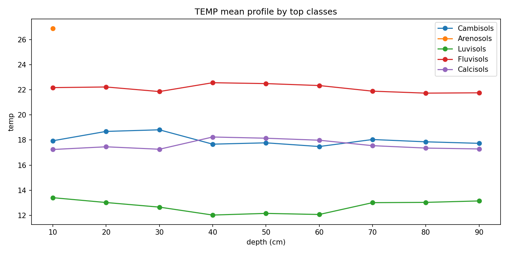

Comentario: complementa la lectura de VWC con gradiente termico vertical y posibles firmas diferenciales por clase.

### Figura 07: Correlacion de predictores

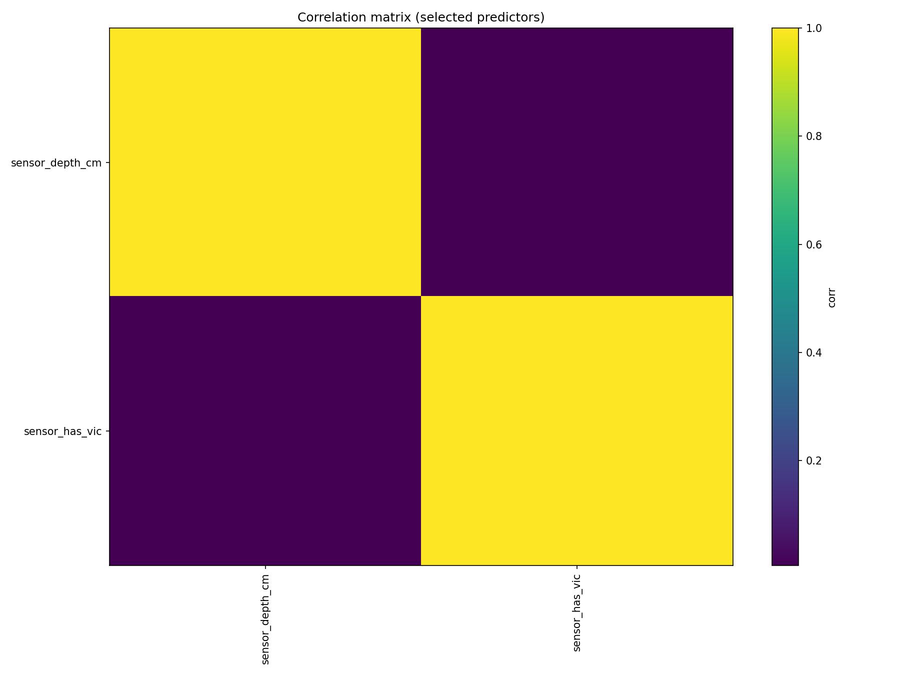

Comentario: revela colinealidad y redundancia entre variables, clave para seleccionar predictores robustos.

### Figura 08: PCA WRB clases principales

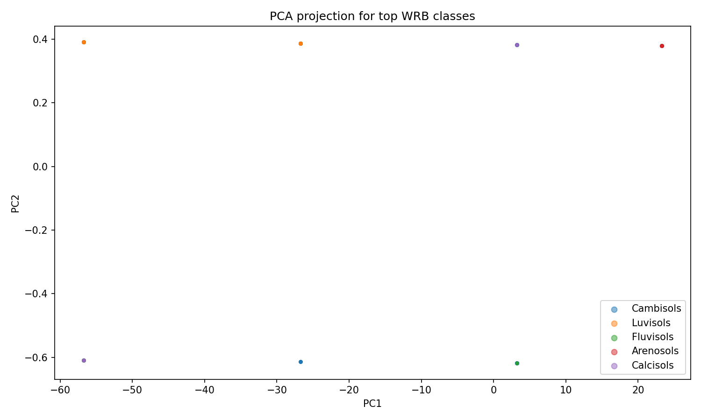

Comentario: ofrece una vista rapida de separabilidad en espacio reducido y posible solape interclase.

### Figura 09: Histogramas de objetivos USDA

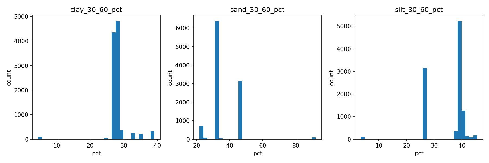

Comentario: resume distribucion de arena, limo y arcilla en porcentaje, y ayuda a detectar sesgos de rango.

### Figura 10: Scatter de textura USDA

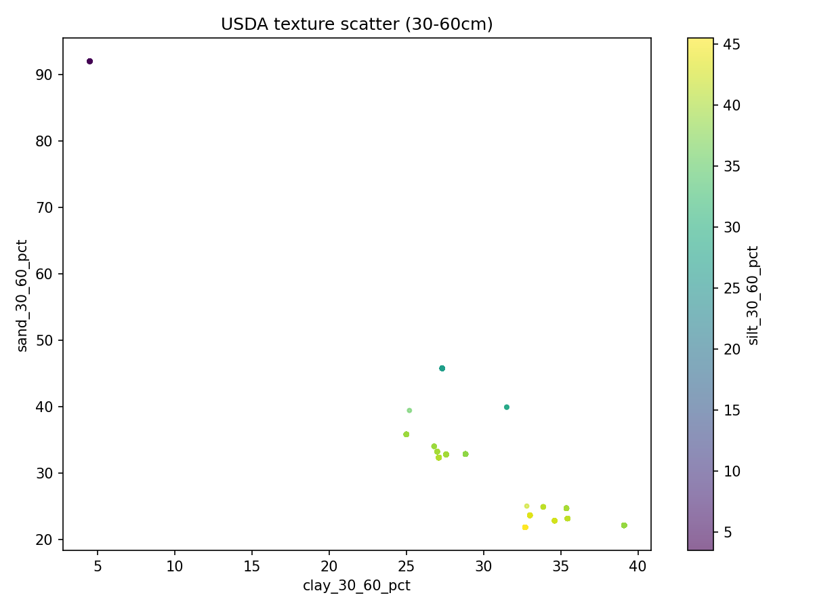

Comentario: visualiza relaciones entre fracciones texturales y regiones de mayor densidad muestral.

### Figura 11: Cobertura de etiquetas en dataset unificado

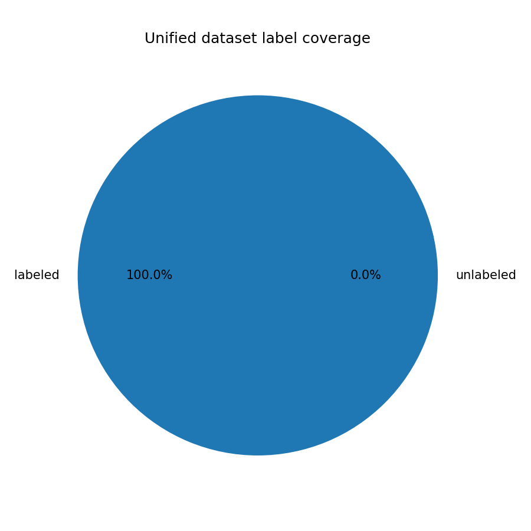

Comentario: cuantifica cobertura real de etiquetado WRB/USDA y delimita el alcance de evidencia supervisada.

### Figura 12: Curva de calibracion

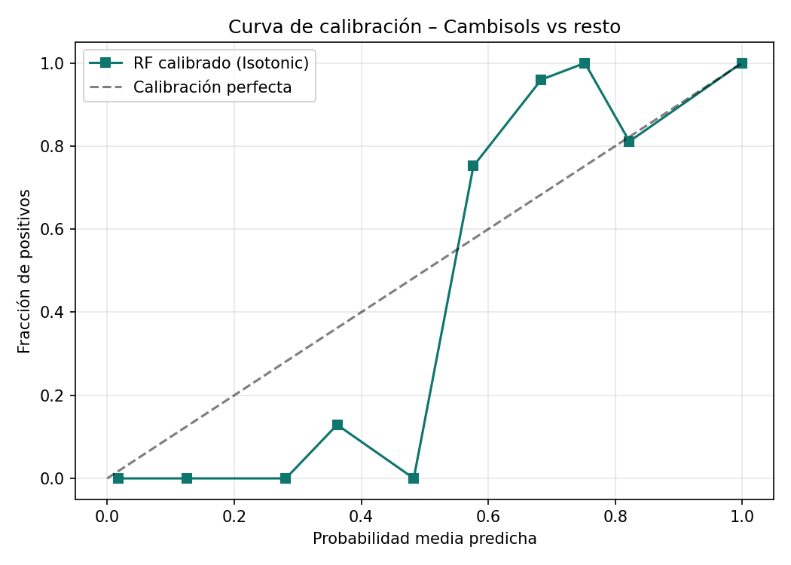

Comentario: compara la probabilidad predicha contra la frecuencia real de Cambisols. Permite ver si el modelo sobreestima o subestima su confianza. Se uso calibracion isotonica (CalibratedClassifierCV).

### Figura 13: Curva de decision

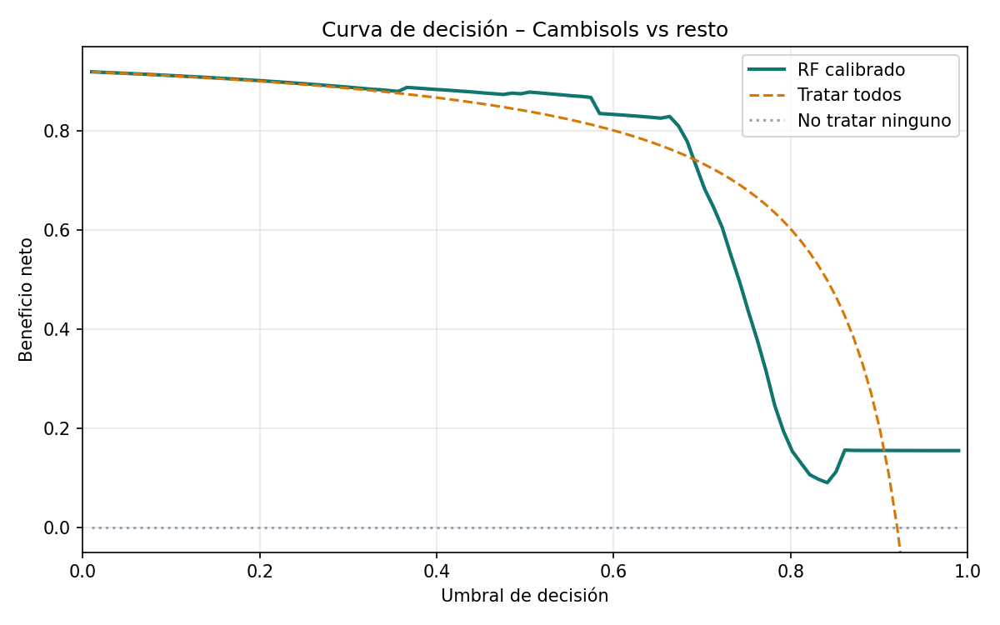

Comentario: muestra el beneficio neto del modelo frente a las estrategias triviales (clasificar todo o nada). Permite elegir el umbral optimo segun el coste operativo de cada decision.

## Patrones detectados (investigacion)

- Predominio de `Cambisols`, con impacto directo en metricas agregadas.
- Clases minoritarias con soporte muestral limitado para inferencia robusta.
- Missingness estructural por profundidad y canal, no completamente aleatoria.
- Posible autocorrelacion temporal e intradispositivo entre filas consecutivas.
- Alto riesgo de sobreestimacion si se valida por fila sin agrupar por sensor y tiempo.

## Riesgos metodologicos y controles

- Riesgo de leakage temporal y por identidad de sensor.
- Riesgo de inflado de accuracy en contexto desbalanceado.
- Riesgo de inferencia fuerte sobre clases con N muy bajo.

Controles recomendados:

- Validacion agrupada por `Imei` y ventanas temporales.
- Metricas macro y por clase ademas de accuracy.
- Baselines explicitos (ZeroR, reglas simples).
- Intervalos de confianza por bootstrap para metricas clave.

## Presentacion ejecutiva

La narrativa visual multipagina esta en [presentacion/index.html](presentacion/index.html) y redirige a [presentacion/dashboard.html](presentacion/dashboard.html).

Secciones principales:

- [presentacion/datos.html](presentacion/datos.html): fuentes y pipeline.
- [presentacion/dashboard.html](presentacion/dashboard.html): exploracion interactiva.
- [presentacion/figuras.html](presentacion/figuras.html): lectura tecnica de figuras.
- [presentacion/conclusiones.html](presentacion/conclusiones.html): patrones, limites y roadmap.

## Convenciones y versionado

- Se versionan scripts y datasets finales listos para modelado.
- Se ignoran artefactos locales, entorno y salidas regenerables mediante `.gitignore`.
- La trazabilidad de calidad se centraliza en el reporte diagnostico.

## Resultados del pipeline de modelado (scikit-learn)

> Ejecutado con `train_sentek_models.py` usando **scikit-learn** (Python).  
> Validacion: **Leave-One-Sensor-Out** — se entrena en sensor X91 y se evalua en X93, y viceversa.  
> Esto es independiente de los datasets Weka (`.arff`, `.csv`) que siguen disponibles para validacion cruzada en Weka.

### Distribucion real de clases WRB (44.011 muestras etiquetadas)

| Clase WRB | N | % |
|---|---|---|
| Cambisols | 39.542 | 89.8% |
| Arenosols | 2.498 | 5.7% |
| Luvisols | 1.138 | 2.6% |
| Fluvisols | 655 | 1.5% |
| Calcisols | 176 | 0.4% |
| Alisols | 2 | <0.1% |

### Clasificacion WRB — comparativa de modelos

| Modelo | Accuracy | Balanced Acc | F1 macro |
|---|---|---|---|
| `RandomForestClassifier` | **0.809** | 0.281 | 0.199 |
| `LogisticRegression` | 0.446 | 0.100 | 0.094 |

**F1 por clase (Random Forest):**

| Clase | F1 |
|---|---|
| Cambisols | **0.938** |
| Arenosols | 0.000 |
| Luvisols | 0.000 |
| Fluvisols | 0.000 |
| Calcisols | 0.000 |
| Alisols | 0.000 |

> La accuracy del 80.9% es enganosa: el modelo aprende a predecir siempre Cambisols (89.8% del set).  
> El F1-macro de 0.199 es la metrica honesta. Las clases minoritarias no se detectan entre sensores distintos.

### Regresion USDA multiobjetivo (clay / sand / silt)

`MultiOutputRegressor` sobre `RandomForestRegressor` y `Ridge`. R² negativo = el patron de textura no se transfiere entre sensores sin recalibracion.

| Target | R² | MAE |
|---|---|---|
| clay 30–60 cm | -1.16 | 16.1% |
| sand 30–60 cm | -0.48 | 21.3% |
| silt 30–60 cm | -1.68 | 24.2% |
| clay 60–100 cm | -1.07 | 16.2% |
| sand 60–100 cm | -0.40 | 21.3% |
| silt 60–100 cm | -2.14 | 26.0% |

**Clase USDA derivada del triangulo de texturas:**

| Clase USDA | N |
|---|---|
| Loam | 60.759 |
| Clay Loam | 28.741 |
| Sandy Clay Loam | 5.566 |
| Sand | 2.494 |
| Loamy Sand | 4 |

### Calibracion probabilistica

Calibracion isotonica (`CalibratedClassifierCV`) sobre problema binario Cambisols vs resto.  
Figuras: [`results/figures/12_calibration_curve.png`](results/figures/12_calibration_curve.png), [`results/figures/13_decision_curve.png`](results/figures/13_decision_curve.png).

### 5) Entrenar modelos (scikit-learn)

```powershell
python train_sentek_models.py
```

Salidas:
- `results/metrics.json` — metricas completas en JSON
- `results/model_report.md` — informe comparativo legible
- `results/figures/12_calibration_curve.png`
- `results/figures/13_decision_curve.png`

## Hoja de ruta sugerida

| Paso | Estado |
|---|---|
| WRB con particion agrupada por sensor (Leave-One-Sensor-Out) | Completado |
| USDA multiobjetivo + derivar clase USDA final | Completado |
| Calibracion probabilistica + curvas de decision | Completado |
| Informe comparativo reproducible (metrics.json + model_report.md) | Completado |
| SMOTE sobre clases WRB minoritarias (Arenosols, Calcisols...) | Pendiente |
| Ampliar a mas sensores para validacion robusta | Pendiente |
| XGBoost / LightGBM como alternativa a RF | Pendiente |
| Explicabilidad SHAP por profundidad y senal | Pendiente |
